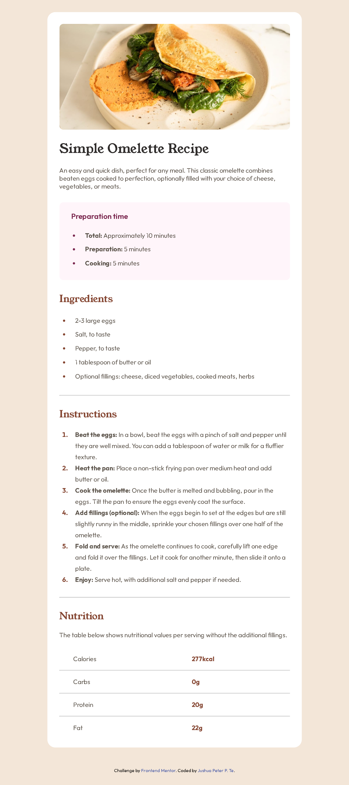

# Frontend Mentor - Recipe page solution

This is a solution to the [Recipe page challenge on Frontend Mentor](https://www.frontendmentor.io/challenges/recipe-page-KiTsR8QQKm). Frontend Mentor challenges help you improve your coding skills by building realistic projects. 

## Table of contents

- [Overview](#overview)
  - [The challenge](#the-challenge)
  - [Screenshot](#screenshot)
  - [Links](#links)
- [My process](#my-process)
  - [Built with](#built-with)
  - [What I learned](#what-i-learned)
  - [Continued development](#continued-development)
- [Author](#author)

**Note: Delete this note and update the table of contents based on what sections you keep.**

## Overview

### Screenshot



### Links

- Solution URL: [https://github.com/JushuaPeterTe/Frontend-Mentor-Challenge---Recipe-Page-Solution](https://github.com/JushuaPeterTe/Frontend-Mentor-Challenge---Recipe-Page-Solution)
- Live Site URL: [https://jushuapeterte.github.io/Frontend-Mentor-Challenge---Recipe-Page-Solution/recipe-page-main/](https://jushuapeterte.github.io/Frontend-Mentor-Challenge---Recipe-Page-Solution/recipe-page-main/)

## My process

### Built with

- Semantic HTML5 markup
- CSS custom properties
- Flexbox
- CSS Grid
- Mobile-first workflow

### What I learned

I learned important usages of 'vw' when I was editing the 'Nutrition' section, I learned how to use padding, and height and width in most complex situations and their unique functions.

```css
.nutrition .serving,
.nutrition .nutritional-values {
    display: inline-block;
    padding: 10px 0px;
    width: 70px;
}

@media (max-width: 480px) {
    html {
        padding: 0px;
    }
    .main-content {
        margin: 5px;
        padding: 4px;
    }
    .sub-content {
        padding: 4px;
    }
    .content {
        padding: 18px;
    }
    .nutrition .serving {
        margin-left: 5vw;
        margin-right: 32vw;
    }
}
```


If you want more help with writing markdown, we'd recommend checking out [The Markdown Guide](https://www.markdownguide.org/) to learn more.

### Continued development

I will continue to test changes using this project to learn more ideas.

## Author

- Website - [Jushua Peter P. Te](https://github.com/JushuaPeterTe)
- Frontend Mentor - [@JushuaPeterTe](https://www.frontendmentor.io/profile/JushuaPeterTe)
